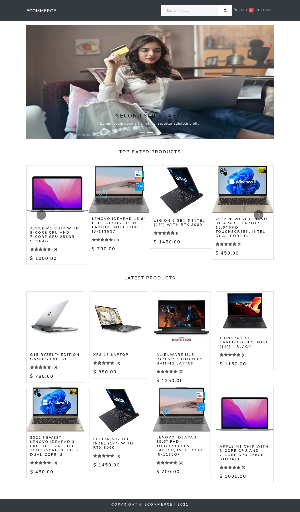
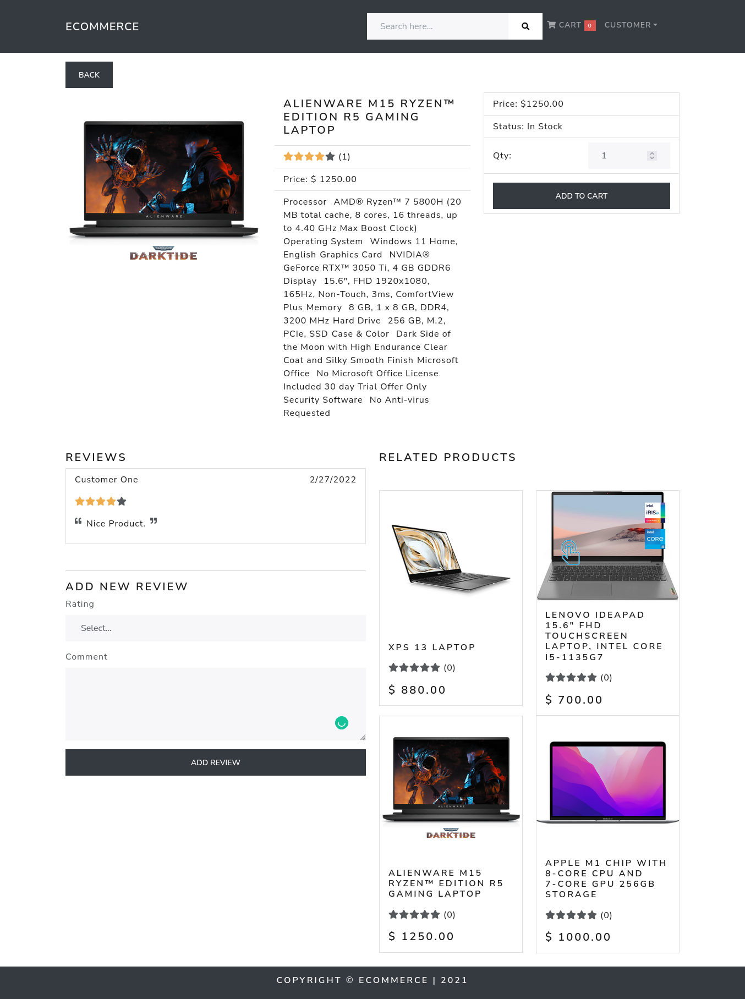
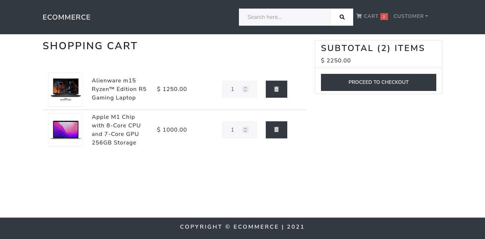
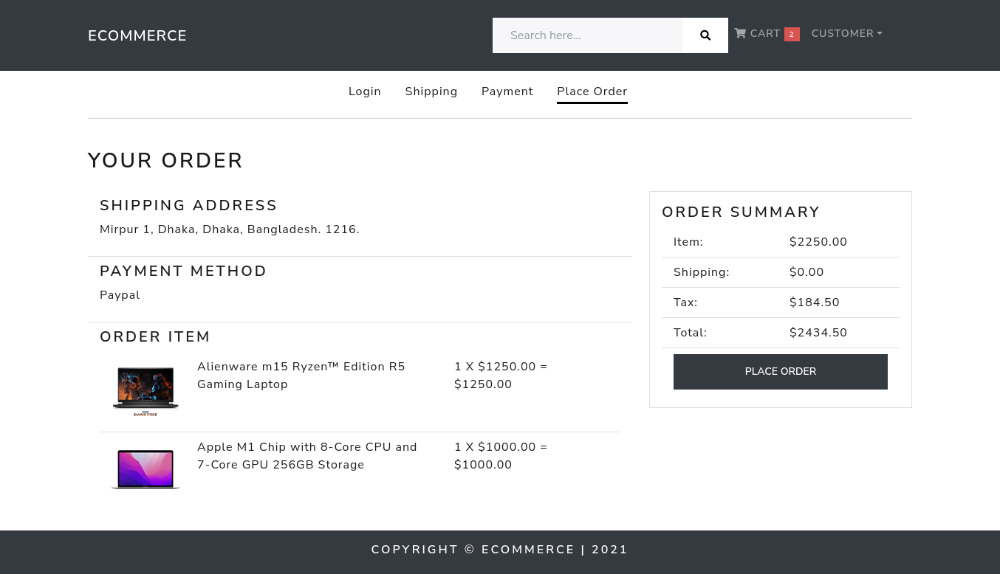
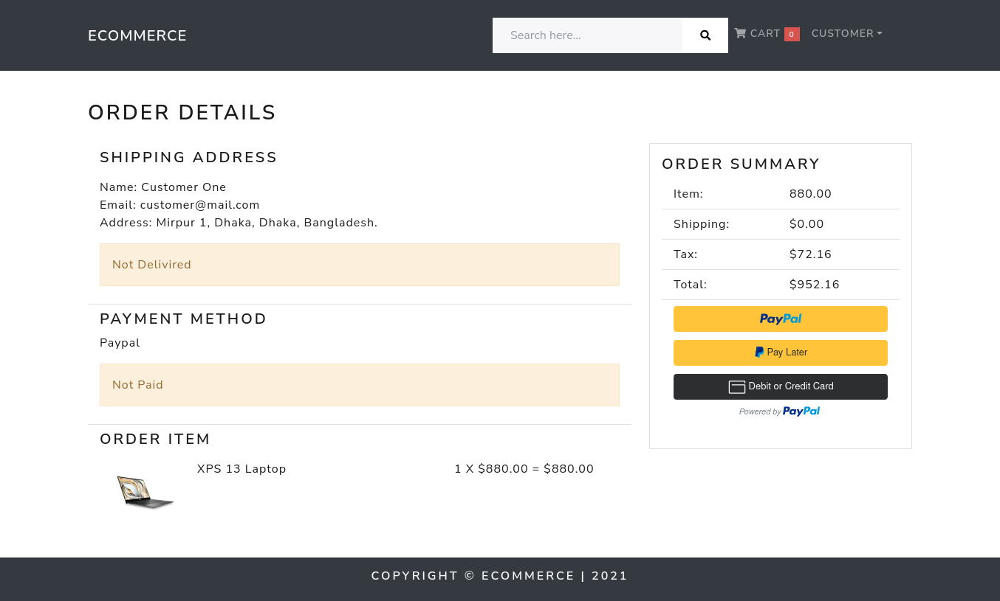
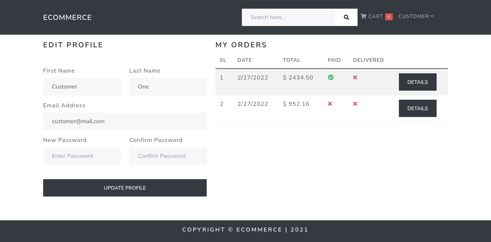
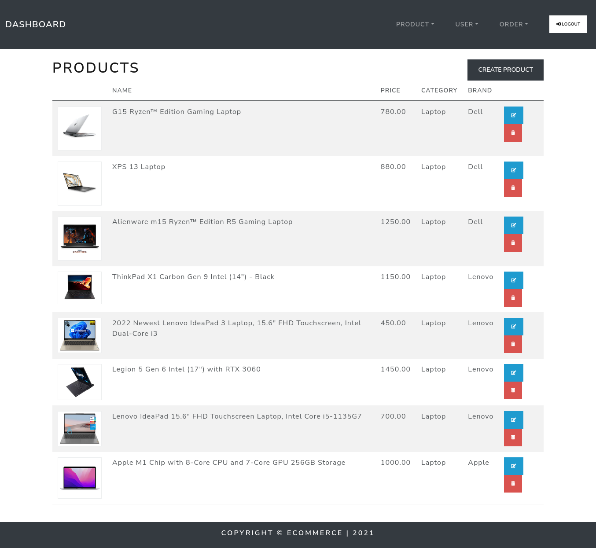
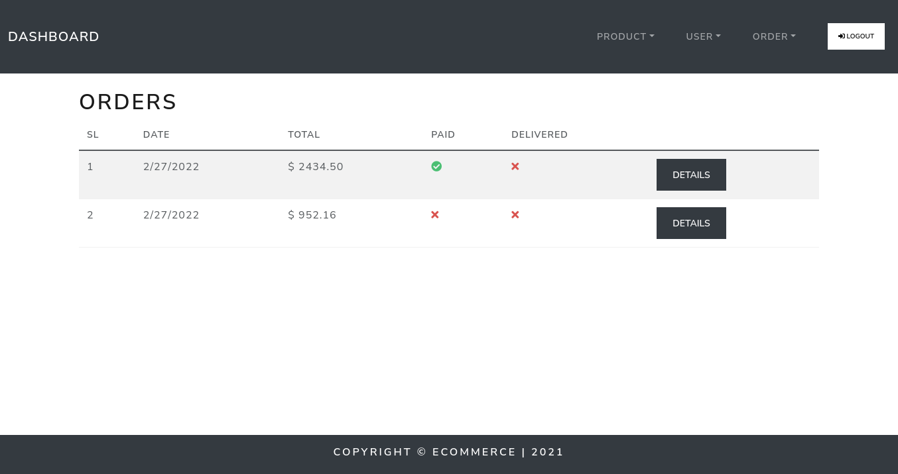
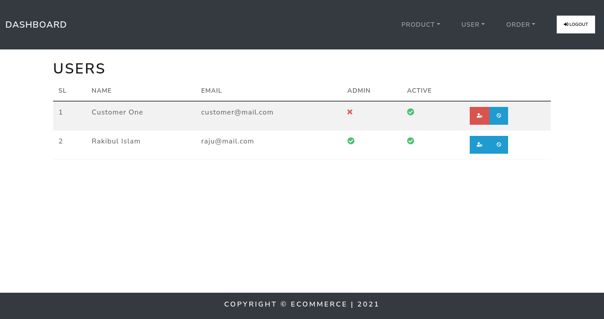

## Ecommerce with Django & React

-   A singlepage ecommerce application with cart, order, payment, review and admin dashboard.
-   Admin can create or edit product fron the dashboard and manage orders and users.
-   User can review a product only after purchase the product.

---

## Installation

#### Django (Backend)

1. Ensure you have python3 installed
2. Clone the repository and cd into **backend** folder
3. Create a virtual environment using `virtualenv venv`
4. Activate the virtual environment by running
    - Linux/Mac `source venv/bin/activate`
    - Windows `source venv\Scripts\activate`
5. Install the dependencies using `pip install -r requirements.txt`
    - Using pipenv `pipenv install & pipenv shell`
6. Migrate existing db tables by running `python manage.py migrate`
7. Run the django development server using `python manage.py runserver`
8. Create Superuser using `python manage.py createsuperuser`

#### React (Frontend)

1. Clone the repository and cd into **frontend** folder
2. Install all the depenencies
    - NPM - `npm i`
    - YARN - `yarn`
3. Runs the app in the development mode.
    - NPM - `npm start`
    - YARN - `yarn start`
4. Builds the app for production to the build folder
    - NPM - `npm run build`
    - YARN - `yarn build`

---

### ScreenShots

##### Homepage

##### Product Details

##### Cart

##### Place Order

##### Payment with Paypal

##### Order Details

##### Profile

##### Dashboard - Products

##### Dashboard - Orders

##### Dashboard - Users

